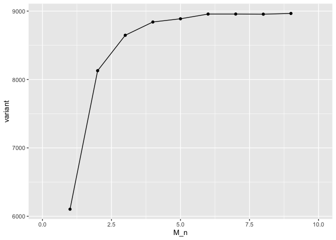

Untitled
================
Bronwyn
2023-03-06

# Download the data

- Connect to the biohpc server
- Make a directory for this data.
- Open the download script provided by BRC and copy the line that is
  relevant for this index group and use wget to download the data into
  this folder

``` bash
ssh bgb27@cubsulogin.biohpc.cornell.edu
#make a directory in my directory for this data.
mkdir Westneat_trial
cd Westneat_trial
wget -q -c -O 13831_3270_184521_HFLNCAFX5_DW10_TAGCTT_R1.fastq.gz "http://cbsuapps.biohpc.cornell.edu/Sequencing/showseqfile.aspx?mode=http&cntrl=1245323501&refid=1007426"
```

# Check the quality of the data

- reserve a machine for computing and log into this machine
- create a working directory on this machine
- copy the raw data into that directory.
- Using `FastQC`, check the quality of the data
  (<https://www.bioinformatics.babraham.ac.uk/projects/fastqc/>)

``` bash
cd /workdir
mkdir bgb27
cp /home/Westneat_trial/*.gz /workdir/bgb27
fastqc 13831_3270_184521_HFLNCAFX5_DW10_TAGCTT_R1.fastq.gz
```

<u>Results:</u> Use Filezilla to transfer the resulting .html files to
your computer and view. [see results
here](./results/13831_3270_184521_HFLNCAFX5_DW10_TAGCTT_R1_fastqc.html)
these results look normal for ddRAD-seq data.

# Filter data

Using the `fastx_trimmer` and `fastq-quality_filter`from the
`FASTX-Toolkit`
<http://hannonlab.cshl.edu/fastx_toolkit/commandline.html>

<u>We will do the following:</u>

- first trim all reads to a length of 147 (this will remove the last 4
  bases of each read. these are the reads with the lowest quality)

- filter reads based on quality: *first* eliminate sequences where there
  is a sinlge base with a Phred score below 10 and *second* eliminate
  sequences where 5% of bases have a with Phred quality scores below 20.

``` bash
gunzip *.gz

fastx_trimmer -f 1 -l 147 -Q33 -i 13831_3270_184521_HFLNCAFX5_DW10_TAGCTT_R1.fastq -o DW10_t.fastq 
fastq_quality_filter -q 10 -p 100 -Q33 -i DW10_t.fastq -o DW10_tf.fastq
fastq_quality_filter -q 20 -p 95 -Q33 -i DW10_tf.fastq -o DW10_tff.fastq
```

# Demultiplex data

We will demultiplex the data using the process_radtags module from
`stacks` (<https://catchenlab.life.illinois.edu/stacks/>)

**Note: Before running stacks you will need to run the following lines
on the cluster to run the current version - see notes
here:<https://biohpc.cornell.edu/lab/userguide.aspx?a=software&i=454#c>
You’ll need to do this each time you log in to the machine.**

``` bash
# First specify the library path and path to stacks-2.59:

export LD_LIBRARY_PATH=/usr/local/gcc-7.3.0/lib64:/usr/local/gcc-7.3.0/lib

export PATH=/programs/stacks-2.59/bin:$PATH
```

First prepare an index file that includes the barcode and sample name
for the 20 samples in the DW10 index group. This should be a tab
delimited file with barcode and name of sample. Make sure there are no
extra lines or characters and save as a txt file. See file
(./scripts/DW10.txt). Use filezilla to transfer this file into the
working directory on your reserved machine.

|         |         |
|:--------|:--------|
| ATCACG  | BT1960  |
| CGATGT  | BT1908  |
| TTAGGC  | BT1935  |
| TGACCA  | BT2057  |
| ACAGTG  | BT1904  |
| GCCAAT  | BT1909  |
| CTTGA   | BT2051  |
| TCACC   | BT2044  |
| CTAGC   | BT1936  |
| ACAAA   | BT1906  |
| AGCCC   | BT2078  |
| GTATT   | BT1934  |
| CTGTA   | BT2026  |
| AGCAT   | BT78495 |
| ACTAT   | BT1945  |
| CTTGCTT | BT1914  |
| ATGAAAC | BT2014  |
| AAAAGTT | BT1939  |
| GAATTCA | BT2029  |
| GGACCTA | BT2010  |

run `process_radtags`:

- create a directory for the trimmed and filtered data - `DW10raw`

- move the trimmed and filtered data into this folder

- create directory for the demultiplexed data - `demultfilter`

- run process_radtags

``` bash
mkdir ./DW10raw
mv ./DW10_tff.fastq ./DW10raw/DW10_tff.fastq
mkdir ./demultfilter

nohup /programs/stacks/bin/process_radtags -p ./DW10raw -b ./DW10.txt -o ./demultfilter -e sbfI -c -q -E phred33 --inline_null -i fastq --adapter_1 GATCGGAAGAGCACACGTCTGAACTCCAGTCACTAGCTTATCTCGTATGCCGTCTTCTGCTTG --adapter_mm 1 --filter_illumina &
```

Determine the \# reads. Count lines and divide by 4.

``` bash
cd demultfilter
wc -l *.fq
```

# Denovo alignment

- explanation of how the denovo pipeline works to form stacks and loci
  and what the parameters mean:
  <http://catchenlab.life.illinois.edu/stacks/param_tut.php>

- see this paper for description of the pipeline we will use: Rochette,
  N., Catchen, J. Deriving genotypes from RAD-seq short-read data using
  Stacks. Nat Protoc 12, 2640–2659 (2017).
  <https://doi-org.proxy.library.cornell.edu/10.1038/nprot.2017.123>

- Create a `popmap` file: This is a tab delimited file with the name of
  the sample and the population (see .scripts/popmap_bushtit.txt)

|         |     |
|:--------|----:|
| BT1960  |   1 |
| BT1908  |   1 |
| BT1935  |   1 |
| BT2057  |   1 |
| BT1904  |   1 |
| BT1909  |   1 |
| BT2051  |   1 |
| BT2044  |   1 |
| BT1936  |   1 |
| BT1906  |   1 |
| BT2078  |   1 |
| BT1934  |   1 |
| BT2026  |   1 |
| BT78495 |   1 |
| BT1945  |   1 |
| BT1914  |   1 |
| BT2014  |   1 |
| BT1939  |   1 |
| BT2029  |   1 |
| BT2010  |   1 |

- create a script (`denovo.sh`) to run the subset of samples through the
  denovo wrapper using different M and n parameters. (see
  ./scripts/denovo.sh)

``` bash
##Run 1
mkdir denovo_run1
denovo_map.pl --samples /workdir/bgb27/demultfilter --popmap /workdir/bgb27/popmap_bushtit.txt -m 3 -M 1 -n 1 -T 15 -o /workdir/bgb27/denovo_run1
populations -P /workdir/bgb27/denovo_run1 -M /workdir/bgb27/popmap_bushtit.txt -t 15 -r 0.8

# note -T or -t = # of threads/CPUs to use
# for populations: -P = path to directory containing the Stacks files (output from the denovo run)
#                  -M = path to the population map (in thsi case same as used in the denovo trial)
#                  -r = minimum percentage of individuals in a population req to have a locus to process the locus

##Run 2
mkdir denovo_run2
denovo_map.pl --samples /workdir/bgb27/demultfilter --popmap /workdir/bgb27/popmap_bushtit.txt -m 3 -M 2 -n 2 -T 15 -o /workdir/bgb27/denovo_run2
populations -P /workdir/bgb27/denovo_run2 -M /workdir/bgb27/popmap_bushtit.txt -t 15 -r 0.8

##Run 3
mkdir denovo_run3
denovo_map.pl --samples /workdir/bgb27/demultfilter --popmap /workdir/bgb27/popmap_bushtit.txt -m 3 -M 3 -n 3 -T 15 -o /workdir/bgb27/denovo_run3
populations -P /workdir/bgb27/denovo_run3 -M /workdir/bgb27/popmap_bushtit.txt -t 15 -r 0.8

##Run 4
mkdir denovo_run4
denovo_map.pl --samples /workdir/bgb27/demultfilter --popmap /workdir/bgb27/popmap_bushtit.txt -m 3 -M 4 -n 4 -T 15 -o /workdir/bgb27/denovo_run4
populations -P /workdir/bgb27/denovo_run4 -M /workdir/bgb27/popmap_bushtit.txt -t 15 -r 0.8

##Run 5
mkdir denovo_run5
denovo_map.pl --samples /workdir/bgb27/demultfilter --popmap /workdir/bgb27/popmap_bushtit.txt -m 3 -M 5 -n 5 -T 15 -o /workdir/bgb27/denovo_run5
populations -P /workdir/bgb27/denovo_run5 -M /workdir/bgb27/popmap_bushtit.txt -t 15 -r 0.8

##Run 6
mkdir denovo_run6
denovo_map.pl --samples /workdir/bgb27/demultfilter --popmap /workdir/bgb27/popmap_bushtit.txt -m 3 -M 6 -n 6 -T 15 -o /workdir/bgb27/denovo_run6
populations -P /workdir/bgb27/denovo_run6 -M /workdir/bgb27/popmap_bushtit.txt -t 15 -r 0.8

##Run 7
mkdir denovo_run7
denovo_map.pl --samples /workdir/bgb27/demultfilter --popmap /workdir/bgb27/popmap_bushtit.txt -m 3 -M 7 -n 7 -T 15 -o /workdir/bgb27/denovo_run7
populations -P /workdir/bgb27/denovo_run7 -M /workdir/bgb27/popmap_bushtit.txt -t 15 -r 0.8

##Run 8
mkdir denovo_run8
denovo_map.pl --samples /workdir/bgb27/demultfilter --popmap /workdir/bgb27/popmap_bushtit.txt -m 3 -M 8 -n 8 -T 15 -o /workdir/bgb27/denovo_run8
populations -P /workdir/bgb27/denovo_run8 -M /workdir/bgb27/popmap_bushtit.txt -t 15 -r 0.8

##Run 9
mkdir denovo_run9
denovo_map.pl --samples /workdir/bgb27/demultfilter --popmap /workdir/bgb27/popmap_bushtit.txt -m 3 -M 9 -n 9 -T 15 -o /workdir/bgb27/denovo_run9
populations -P /workdir/bgb27/denovo_run9 -M /workdir/bgb27/popmap_bushtit.txt -t 15 -r 0.8
```

- transfer the script and the popmap file to the working directory using
  `Filezilla`.

- run the script

``` bash
nohup bash denovo.sh &
```

using grep find the information about the sites from each of these
runs - this will be in the nohup.out file (make a tab deliminated file -
./results/denovo_results)

``` bash
grep "all/variant/polymorphic sites" nohup.out
```

``` r
read_tsv("./results/denovo_results", col_types = "iiiiii") %>%
  select("M_n":"variant") %>% 
  kable()
```

| M_n |    all | variant |
|----:|-------:|--------:|
|   1 | 835424 |    6103 |
|   2 | 858009 |    8129 |
|   3 | 862124 |    8647 |
|   4 | 863406 |    8841 |
|   5 | 862551 |    8888 |
|   6 | 862694 |    8957 |
|   7 | 861571 |    8957 |
|   8 | 861139 |    8955 |
|   9 | 861278 |    8966 |

plot the \# variants for each M/n parameter:

``` r
read_tsv("./results/denovo_results", col_types = "iiiiii") %>% 
ggplot(mapping = aes(x = `M_n`, y = `variant`)) +
  geom_point() +
  geom_line() +
  xlim (0,10)
```

<!-- -->

Based on these results I will select a M/n value of 6 for the denovo
alignment. Since we only have one index group of samples at this time I
ran populations again on the denovo run \#6 with extra filtering…

- in the denovo_run6 directory in the workdir run the following:

``` bash
populations -P /workdir/bgb27/denovo_run6 -M /workdir/bgb27/popmap_bushtit.txt -r 0.80 -p 1 -t 15 --min-maf 0.05 --write-single-snp --structure
```

-r = minimum percentage of individuals in a population required to
process a locus for that population. –min-maf — specify a minimum minor
allele frequency required to process a nucleotide site at a locus (0 \<
min_maf \< 0.5; applied to the metapopulation). –write-single-snp —
restrict data analysis to only the first SNP per locus. –structure —
output results in Structure format.

<u>Results:</u>

    Removed 8705 loci that did not pass sample/population constraints from 14849 loci.
    Kept 6144 loci, composed of 862694 sites; 1782 of those sites were filtered, 3561 variant sites remained.
    Mean genotyped sites per locus: 140.41bp (stderr 0.02).

    Population summary statistics (more detail in populations.sumstats_summary.tsv):
      1: 19.184 samples per locus; pi: 0.29875; all/variant/polymorphic sites: 862694/3561/3561; private alleles: 0

*You can open the structure file in excel by changing the file extension
to .xls and then you can investigate the SNPs and see which samples have
a lot of missing data etc.*
